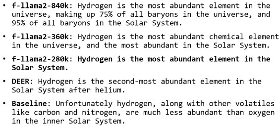

# Enhancing Relation Descriptions Generation in DKG via LLM Finetuning
The code and data for [2023 Summer FORWARD Lab Research Work](https://drive.google.com/file/d/1S0VIEh5xL3KxUTmNwlYpz_O4tYWNhQLj/view?usp=sharing).

## Introduction
A Descriptive Knowledge Graph (DKG) contains textual decriptions of the relationships between entities. Leveraging the capabilities
of large language models (LLM), we use the QLoRA method to finetune the Llama2-7b model on this relation description generation task. And the results outperform the baseline and the SOTA model [DEER](https://arxiv.org/pdf/2205.10479.pdf).

Evaluation results of finetuned Llama2 models:


Generated relation descriptions for the concept pair "Hydrogen" and "Solar System", with f-llama2-280k exhibiting optimal performance.


## Requirements
See `requirements.txt` (python=3.10.12).

## Data
The original data constructed by [DEER](https://github.com/jeffhj/DEER/tree/main) are available on this [link](https://drive.google.com/drive/folders/1YDOZwqQ7aWfMpmLRwC_VVCFFq2hIKZlJ?usp=sharing).

### Finetune Dataset Preparation
1. Download the above data to the [data_preparation](./data_preparation/) folder, you will get three split datasets `train.json`, `dev.json` and `test.json`.

2. To transfer the origin data to the format with target relation-description, explicitness-score, significance-score and RDScore, run
    ```
    python RDScore_sort.py ./data_preparation/
    ```

3. Choose a RDScore-threshold value (default 0.75) to filter samples with RDScore greater or equal than the threshold and then construct the instruction-based finetune dataset based on the selected data by running 
    ```
    python generate_finetuneDataset.py [RDScore_threshold]
    ```
    and you will get csv files named `train_slice.csv` and `dev_slice.csv`.

## Finetune LLM
1. After having the finetune datasets prepared, you can start finetuning the `Llama2-7b` model by running 
    ```
    python finetune.py
    ```

2. After finetuning is finished, you can run 
    ```
    python load_inference.py
    ```   
    to perform inference on the test dataset using the finetuned model. And you will get the output `f-llama2_output.json`.

(You may need to run `export CUDA_VISIBLE_DEVICES=0` in command line to specify the gpu device.)

## Evaluation
1. For evaluation, you need to prepare a `corePath_Counter` and a `subPath_Counter` based on the corresponding corpus. Place the [wiki_corpus.json](https://drive.google.com/file/d/1zCLRyIxEcVY-zLPe7eUfISPV6ht__YtS/view?usp=sharing) file under the [evaluation](./evaluation/) folder, run
    ```
    python RDScore.py generate_counters
    ```

2. You can then obtain the results of `avg_ExpScore`, `avg_SigScore` and `avg_RDScore` and compare with the baseline by running
    ```
    python RDScore.py f-llama2_output.json baseline
    ```


[--- Link for demo ---](https://drive.google.com/file/d/1hG1wGonzqF5v1SNtLKqG82ogn0TMBrZ1/view?usp=sharing)
